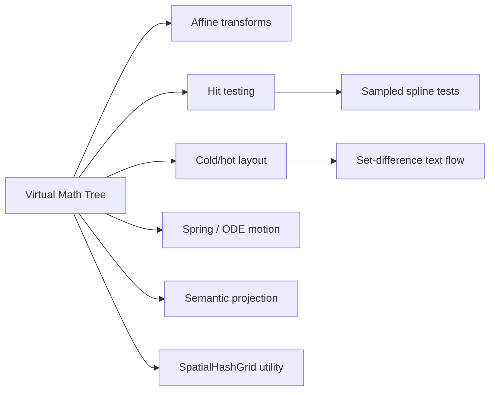

# Engine Concepts

VectoJS is built on a small set of math and runtime ideas. This page is a map; the deeper derivations live in [Mathematical Foundations](/learn/math-foundations/).

## 1. Virtual Math Tree

The VMT replaces a visual DOM subtree with a JavaScript scene graph of localized coordinate systems. Traversal, hit-testing, and accessibility synchronization are still real work, but visual layout avoids browser style and reflow for each entity.

- Theory: [Mathematical Foundations: VMT](/learn/math-foundations/#1-the-virtual-math-tree-vmt)
- Practice: [Core Scene](/learn/core-scene/)

## 2. Semantic projection overlay

Eligible interactive entities project real transparent DOM nodes over their canvas bounds. The canvas owns pixels; the DOM projection owns role/name/state and native input behavior.

- Theory: [Mathematical Foundations: a11yRoot](/learn/math-foundations/#2-semantic-shadow-dom-a11yroot)
- Practice: [Accessibility](/learn/accessibility/)

## 3. Affine transformations

Entity translation, scale, and rotation compose down the tree. `worldToLocal()` analytically inverts the transform so pointer events can be mapped into the target entity’s local coordinates.

- Theory: [Mathematical Foundations: affine transforms](/learn/math-foundations/#3-affine-transformations)

## 4. Cold/hot layout

Text layout separates expensive content preparation from responsive wrapping. Content changes run the cold path; width changes can reuse prepared measurements.

- Theory: [Mathematical Foundations: Cold/Hot Split](/learn/math-foundations/#4-coldhot-split-layout-engine)
- Practice: [Text & Typography](/learn/text-typography/)

## 5. Set-difference text flow

Wrapping around obstacles can be modeled as interval subtraction:

$$I_{\text{allowed}} = I_0 \setminus \bigcup E_k$$

- Theory: [Mathematical Foundations: Set-Difference Algebra](/learn/math-foundations/#5-set-difference-algebra-for-text-flows)

## 6. Sampled spline hit-testing

`SplineEntity` samples curves into cached line segments and compares squared pointer distance against those segments. This avoids pixel reads and is more precise than AABB-only hit tests.

- Theory: [Mathematical Foundations: Sampled Spline Hit-Testing](/learn/math-foundations/#6-sampled-spline-hit-testing)

## 7. Semi-implicit Euler dynamics

Interrupted UI transitions are modeled as spring-like systems instead of one-shot CSS timers. Targets can change mid-flight while motion stays continuous.

- Theory: [Mathematical Foundations: ODE Dynamics](/learn/math-foundations/#7-differential-equations--semi-implicit-euler-solvers)
- Practice: [Physics & Animation](/learn/physics-engine/)

## 8. SpatialHashGrid utility

VectoJS exports a fixed-cell `SpatialHashGrid` for application-owned proximity queries. The Scene does not automatically populate it for every entity.

- Theory: [Mathematical Foundations: SpatialHashGrid Utility](/learn/math-foundations/#8-spatialhashgrid-utility)
- Practice: [Performance](/learn/performance/)

## Next steps

- [Runtime Architecture](/learn/runtime-architecture/) connects these concepts to the frame pipeline.
- [Mathematical Foundations](/learn/math-foundations/) goes deeper into the formulas.
