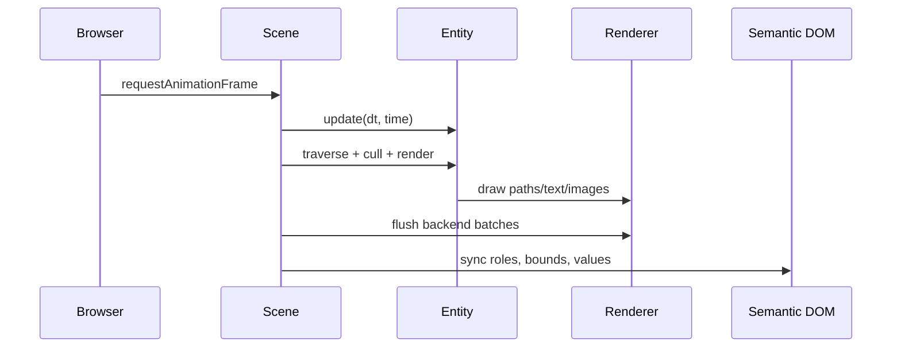

# Runtime Architecture

VectoJS is organized around one `Scene` per canvas and a retained tree of `Entity` instances. The tree stores visual state, layout state, event behavior, and semantic metadata.

<figure>
  
  <figcaption>The Scene walks a Virtual Math Tree, renders pixels to canvas, and projects semantics into DOM.</figcaption>
</figure>

## Virtual Math Tree

Each entity has:

- `x`, `y`, `scaleX`, `scaleY`, `rotation`, and `opacity`;
- `width` and `height` for bounds;
- a `children` array;
- `update(dt, time)` for state changes;
- `render(renderer)` for drawing in local coordinates;
- `isPointInside(globalX, globalY)` for hit-testing;
- optional `getA11yAttributes()` for projected semantics.

Transforms compose down the tree. Use `worldToLocal()` when hit-testing nested or transformed entities.

## Frame pipeline

<figure>
  <iframe src="/sandbox/diagram-pipeline.html" class="diagram-frame" loading="lazy" title="The VectoJS render loop: the six stages of one dirty frame, rendered live by VectoJS" sandbox="allow-scripts allow-same-origin"></iframe>
  <figcaption>One dirty frame: update, cull, render, flush backend batches, then sync projected DOM.</figcaption>
</figure>



## Accessibility projection

A transparent DOM layer sits above the canvas. Interactive entities can project real elements such as `<button>`, `<input>`, `<a>`, and role-bearing `<div>` nodes.

That layer makes canvas UI:

- discoverable by screen readers;
- operable through keyboard and native form controls;
- testable with Playwright role selectors;
- drivable by AI agents that rely on DOM semantics.

The projection is not a substitute for design review. Applications still own labels, focus order, keyboard behavior, contrast, and reduced-motion behavior.

## Rendering backends

| Backend           | When                        | Capability                                |
| ----------------- | --------------------------- | ----------------------------------------- |
| `CanvasRenderer`  | Default                     | Canvas 2D with device pixel ratio scaling |
| WebGL point layer | `pointBackend: 'webgl'`     | Batched circles/rects and GPU glyph paths |
| WebGPU compute    | `particleBackend: 'webgpu'` | Compute-driven particles with fallback    |
| `SVGRenderer`     | `scene.toSVG()`             | Headless SVG export                       |

Backend choice only helps when the backend matches the bottleneck. If text layout or app compute dominates, changing Canvas to WebGL will not fix the slow path.

## Lifecycle

```ts
const scene = new Scene(canvas, { maxFPS: 60 });
scene.renderMode = 'onDemand';
scene.resize(width, height);
scene.start();

// later
scene.destroy();
```

Always destroy a scene when the host component unmounts. A scene owns renderer resources, observers, workers, projected DOM, and event state.

## Next steps

- [Engine Concepts](/learn/engine-concepts/) explains the math pillars.
- [Core Scene](/learn/core-scene/) shows the practical API.
