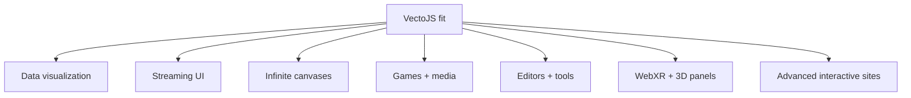

# Use Cases

VectoJS works best when the UI behaves like a live scene: many objects, custom geometry, high-frequency updates, or non-DOM rendering surfaces.

## Data visualization and dashboards

Charts, topology viewers, traces, and real-time dashboards often need hundreds or thousands of animated primitives. VectoJS keeps visual entities in JavaScript and avoids one styled DOM node per point, row, or edge.

Good fits:

- financial order books;
- Kubernetes topology viewers;
- live network graphs;
- monitoring traces and timelines;
- high-frequency analytics surfaces.

## Streaming UI

LLM clients, danmaku, event feeds, and live chat benefit from incremental layout and canvas rendering. `RichText.appendSpans()` and `Markdown.appendMarkdown()` let the app append streaming content without rebuilding every visible object from scratch.

Good fits:

- AI chat clients;
- video comment overlays;
- live logs and event feeds;
- streamed Markdown with code, tables, and diagrams.

## Infinite canvases and graphs

Whiteboards, node editors, and knowledge graphs need pan/zoom, custom hit-testing, and culling. VectoJS provides the scene graph and render/event model; applications can add their own indexing strategy for very large data sets.

Good fits:

- collaborative whiteboards;
- mind maps and knowledge graphs;
- node editors;
- timeline and diagramming tools.

## Games and interactive media

`update(dt)`, animation drivers, particle systems, and custom entities are useful for browser-native games and educational simulations without adopting a full game engine.

Good fits:

- rhythm/game-like interactions;
- physics sandboxes;
- explainer animations;
- interactive course materials.

## Editors and developer tools

Canvas-based editors need explicit control over text, selection visuals, cursors, minimaps, and overlays. VectoJS can provide the visual runtime while native `Input`/`TextArea` components keep browser editing behavior where it matters.

Good fits:

- diff viewers;
- terminal-like surfaces;
- rich canvas editors;
- trace/log tools.

## WebXR and 3D interfaces

`@vectojs/three` renders a VectoJS scene to a `THREE.CanvasTexture`, then maps raycast UVs back into the 2D scene. This enables live VectoJS panels inside Three.js and WebXR.

Good fits:

- in-world controls;
- VR/AR dashboards;
- instrument panels;
- spatial developer tools.

## Advanced interactive websites

VectoJS can power the parts of a site that need physics, particle fields, magnetic typography, generated art, or bespoke interaction. Keep surrounding document structure in HTML/CSS and embed VectoJS only where the scene model pays for itself.

## Fit checklist

Use VectoJS if most answers are “yes”:

- Does the UI have many moving or individually hit-tested objects?
- Does it need math-defined layout or transforms?
- Does it need canvas/WebGL/WebGPU rendering?
- Does it still need accessibility and role-based automation?
- Would DOM/CSS layout become the bottleneck or the wrong abstraction?

If most answers are “no”, start with HTML/CSS and a conventional app framework.

## Next steps

- [Getting Started](/learn/getting-started/) for a first scene.
- [Performance](/learn/performance/) for measurement and scaling guidance.
- [@vectojs/three](/reference/three/) for 3D embedding.
